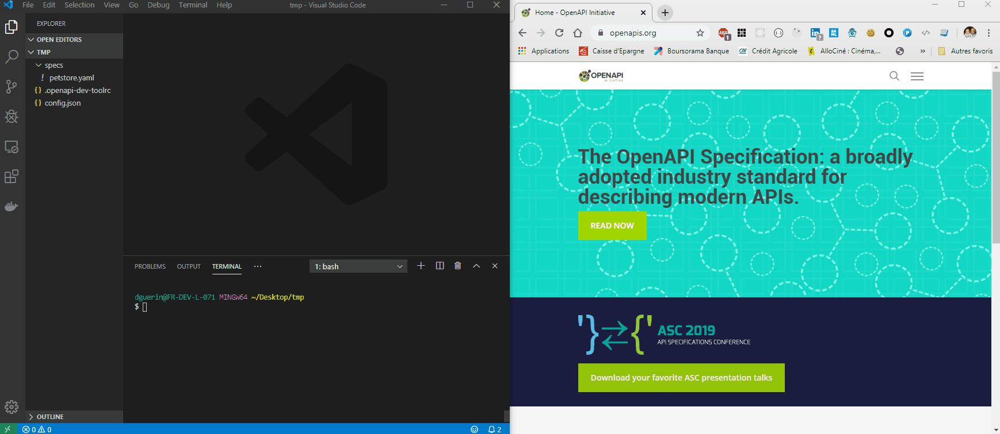
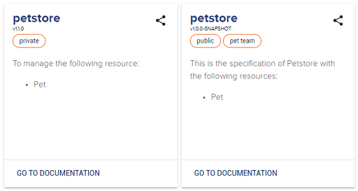

# OpenAPI Dev Tool

[](https://opensource.org/licenses/Apache-2.0)
<!-- AUTO-GENERATED-CONTENT:START (badgePlugin:src=./scripts/badge-template) -->
[](https://travis-ci.org/lyra/openapi-dev-tool)
<!-- AUTO-GENERATED-CONTENT:END -->
[](https://www.npmjs.com/package/@lyra-network/openapi-dev-tool)
[](https://www.npmjs.com/package/@lyra-network/openapi-dev-tool)

## Sponsor

`openapi-dev-tool` is a tool developed by [Lyra Network](https://www.lyra.com/)


## What is OpenAPI?

[OpenAPI](https://swagger.io/docs/specification/about/) specification is an API description format for REST APIs where you can describe your entire API, including:

- Available endpoints (/users) and operations on each endpoint (GET /users, POST /users)
- Operations input and output parameters
- Authentication methods
- Contact information, license, terms of use and other information

## Aim

Although using OpenAPI comes with a lot of advantages (documentation and code generation, faster API publishing, teams collaboration promotion...), industrializing it remains complicated due to certain shortcomings. Using a single OpenAPI file for several contexts (public and private usage for example) is not supported by the current release of OpenAPI. Using the external references to design your API from several files to facilitate the maintainability is still required. Painlessly publish your specifications into a software repository to be able to reuse it (to generate client or server code). Etc.
Also, the OpenAPI ecosystem is very large (https://openapi.tools/) with a lot of tools with different quality levels. Consequently, to set up a complete development environment, many tools have to be installed and upgraded regularly.

OpenAPI Dev Tool fixes all these issues by offering to developers a unique tool to address development and industrialization needs!

From `openapi-dev-tool` command-line interface, you can:

- design your OpenAPI specifications for several contexts of uses (without any copy-paste) ;
- write your OpenAPI specifications by using several files (to avoid having a unique large and unmaintainable file) ;
- easily publish your OpenAPI files and reuse them to generate your client or your server ;
- view documentation in real-time ;
- validate your OpenAPI specifications and your examples automatically ;
- etc.



## Installation

1. Install `Node.JS` (https://nodejs.org/)

1. Install `OpenAPI Dev Tool` tool

   - With npm
     > `npm i -g @lyra-network/openapi-dev-tool`
   - With yarn
     > `yarn global add @lyra-network/openapi-dev-tool`

1. Show usage
   > `openapi-dev-tool help`

## Features

### Serving

#### Overview

> Develop your specifications!

- **Serve one or several OpenAPI files** specified in [configuration file](#configuration-file) and written in YAML or JSON
- **Live reloading** to view dynamically your changes in your browser in real-time
- **Bundle OpenAPI files** to merge all the files before serving. By using [OpenAPI remote reference](https://swagger.io/docs/specification/using-ref/), you can work on several files. It improves the maintainability and avoids having a large OpenAPI file!
- **Several documentation viewers embedded** with the possibility to [override the templates](#templates-override) used:
  - Redoc (http://localhost:3000)
  - RedocPro (http://localhost:3000) --> RedocPro to have "try it" feature
  - Swagger UI (http://localhost:3000/swagger-ui)
- **`x-tags` vendor extension** in `Info` object to be able to [tag OpenAPI files](#tags-usage). OpenAPI doesn't support specifications tags and only supports operations tags (for organization purposes). With the `x-tags` vendor extension and for Redoc viewer, it is now possible to categorize and organize specifications.
- **Validate** your specifications and your examples automatically

For example, declare a private and a public specifications:



- **Context uses**: it is possible to serve a same specification in [several contexts](#context-usage) (internal, public, etc.)

#### Usage

Usage can be displayed by typing the command

> `openapi-dev-tool help serve`

```
openapi-dev-tool serve

  Serve one or serveral OpenAPI specification files in YAML or JSON
  format

Command Options

  -b, --skipBundle             Skips bundle openapi files into one before serving or publishing, default is
                               false
  -p, --port string            Port to use, default is 3000
  -r, --skipRedocConsoleUse    Skips Redoc console use (RedocPro) to disable "try it" feature, default is
                               false
  -e, --viewsFolder string     Folder that contains views in EJS to override defaults
                               - "api.ejs": for API List page
                               - "redoc.ejs": for Redoc page
                               - "swagger-ui.ejs": for Swagger UI page

Global Options

  -c, --config string   Configuration file in JSON or YAML format where specifications are defined, default is config.json
  -v, --verbose         Verbose mode, default is false
```

### Publishing

#### Overview

> Publish your specifications!
> Use the version and title of your specifications to publish them directly in your software repository server!

- **Publish one or several OpenAPI files** specified in [configuration file](#configuration-file) and written in YAML or JSON
- **Bundle OpenAPI files** to merge all the files before publishing. By using (OpenAPI remote reference)[https://swagger.io/docs/specification/using-ref/], you can work on several files. It improves the maintainability and avoid having a large OpenAPI file!
- **Context uses**: it is possible to serve a same specification in [several contexts](#context-usage) (internal, public, etc.)

#### Usage

> **Warning**
>
> To publish your OpenAPI files, the `curl` command must be available on the host where `openapi-dev-tool` is executed.
> `curl` is available under UNIX systems and Windows 10. For Windows < 10, you can download it from https://curl.haxx.se/windows/.

Usage can be displayed by typing the command

> `openapi-dev-tool help publish`

```
openapi-dev-tool publish

  Publish into a software repository server (like Sonatype Nexus) one or serveral OpenAPI specifications
  files

Command Options

  -b, --skipBundle               Skips bundle openapi files into one before serving or publishing, default is
                                 false
  -g, --groupId string           GroupId used in repo server, default is com.openapi
  -s, --repoServer string        Repository server url to store OpenAPI specification files
  --repoSnapshotsServer string   Repository server url to store OpenAPI snapshots specification files. If specified,
                                 --repoServer will be used to store OpenAPI releases specification files.
  -u, --repoUser string          Repository server username
  -p, --repoPassword string      Repository server password
  -x, --skipValidation           Skips OpenAPI validation process, default is false

Global Options

  -c, --config string   Configuration file in JSON or YAML format where specifications are defined, default is config.json
  -v, --verbose         Verbose mode, default is false
```


### Publishing Locally

#### Usage

Usage can be displayed by typing the command

> `openapi-dev-tool help publish-local`

```
openapi-dev-tool publish-local

  Publish into a local Maven repository

Command Options

  -b, --skipBundle               Skips bundle openapi files into one before serving or publishing, default is
                                 false
  -g, --groupId string           GroupId used in repo server, default is com.openapi
  -d, --repoPath string          Path of Maven local repository, default is 'auto': determinated automatically
                                 by using 'mvn' command (if available)
  -x, --skipValidation           Skips OpenAPI validation process, default is false

Global Options

  -c, --config string   Configuration file in JSON or YAML format where specifications are defined, default is config.json
  -v, --verbose         Verbose mode, default is false
```

> **Warning**
>
> By using `repoPath` with `auto`, `openapi-dev-tool` is going to determinate local repository path automatically from `mvn` command. So, in this mode, `mvn` command has to be available in PATH.

### Merging

#### Overview

> Merge your specification!
> To debug, it can be interesting to get the merge result used by `publish`, `publish-local` and `serve` command.

- **Merge split OpenAPI specification files** i.e. components specific files, paths specific files, info, etc. that can be written in YAML or JSON into a single file (per OpenAPI specification)

#### Usage

Usage can be displayed by typing the command

> `openapi-dev-tool help merge`

```
openapi-dev-tool merge

  Merge split OpenAPI specification (components, paths, info, etc.) into a bundled specification file

Command Options

  -o, --output string            Merged file output directory

Global Options

  -c, --config string   Configuration file in JSON or YAML format where specifications are defined, default is config.json
  -v, --verbose         Verbose mode, default is false
```

## Configuration file

Configuration file is the main item to execute `openapi-dev-tool`. Written in JSON or YAML format, this configuration file contains the specifications list that have to be served, published or merged.
It also describes additional parameters used by specific commands (as described above).

```yaml
{
    "folder": "./specs",              // Root folder where the specifications are stored
    "specs": [                        // Array of specifications (several specifications can be exposed)
        {                             // First specification file
            "file": "/petstore.yaml", // Relative path of the specification main file (from "folder" parameter). It has to be an OpenAPI file in YAML or JSON.
            "context": {              // Object used for template generation (see Template usage chapter below)
              ...
            }
        },
        {                             // Second specification file
            "file": "/petstore2.yaml",
            ...
        }
    ]
}
```

## Advanced usage

### Command options from RC File

It is possible to specify the whole of command options of `publish`, `publish-local`, `serve`, `merge` commands by using a rc file (in JSON) rather to specify these from command-line.
For example:

`cat .openapi-dev-toolrc`

```
{
     "repoServer": "https://myServer/repository/openapi",
     "repoUser": "admin",
     "repoPassword": "admin",
     "groupId": "com.myCompany.openapi"
}
```

### Templates override

By default, the serve feature renders HTML content by parsing EJS templates defined in `openapi-dev-tool` module:

- `api.ejs`: for API List page. This page lists all the available APIs before accessing it with Redoc viewer
- `redoc.ejs`: for Redoc page. This page loads Redoc viewer.
- `swagger-ui.ejs`: for Swagger UI page. This page loads Redoc viewer.

From `viewsFolder` command option of `serve` command, you can specify a folder where your own EJS templates are defined the change the HTML generated.

For example, `api.ejs`:

```html
<!DOCTYPE html>
<html>
  <head>
    <title>My Company</title>
  <head>
  <body>
  <% specs.forEach(function(spec){ %>
    <a href="./redoc?specName=<%=spec.name%>"><%=spec.name%></a>
  <% }); %>
  </body>
</html>
```

For each template, the following objects are loaded in EJS context:

- `api.ejs`
  - `specs`: array of OpenAPI specifications where each `spec` item contains the following attributes:
    - `name`: name of specification
    - `version`: version of specification
    - `description`: description converted in HTML (from Markdown)
    - `url`: url where specs can be viewed
    - `file`: file of specification
    - `context`: current context
    - `tags`: tags loaded by using the `x-tags` vendor extension
- `redoc.ejs`
  - `skipRedocConsoleUse`: boolean that indicates if we want use Redoc or Redoc Pro viewer
  - `spec`: object with only `url` attribute
- `swagger-ui.ejs`
  - `specs`: array of OpenAPI specifications where each `spec` item contains the following attributes:
    - `name`: name of specification
    - `url`: url where specs can be viewed

### Context usage

It is possible to serve, publish and merge a same API for several contexts.
For example, for some use-cases a same API should be used in several contexts: from customers (public access) and from internal systems (private access). The API is exactly the same, only the authentication layer could be different. To avoid duplicating your OpenAPI specification, you can use the same API executed in two contexts (public and private).

To do that, you can use EJS template directly in your OpenAPI files to specify different behaviors where `context` specified in Configuration file will be used for rendering. For example for public access, we want to add a security layer which doesn't exist for internal access:

`specs.yaml`

```yaml
openapi: 3.0.0
...

components:
<%if (public) { %>
  securitySchemes:
    basicAuth:
      type: http
      scheme: basic
<% } %>

...

<%if (public) { %>
security:
- basicAuth: []
<% } %>
...
```

This specification could be used in several contexts (public or internal):

`config.json`

```json
{
  "folder": "./specs",
  "specs": [
    {
      "file": "/specs.yaml",
      "context": {
        "public": false
      }
    },
    {
      "file": "/specs.yaml",
      "context": {
        "public": true
      }
    }
  ]
}
```

### Tags usage

In OpenAPI specifications, it is possible to use a `Tag` object to group operations in several categories. It is great to organize our specifications but it is not usable to tag all the OpenAPI files. For example, to indicate that the current specification is public, internal, etc.

To cover this need, we use an OpenAPI vendor extension `x-tags` in `Info` object. This new field is a string array that contains tags of the current specification.

For example:
`specs.yaml`

```yaml
openapi: 3.0.0

info:
  version: 1.0.0
  x-tags:
    - public
```

These tags are displayed in API pages (before Redoc page).

## License

[Apache 2.0 License](LICENSE)